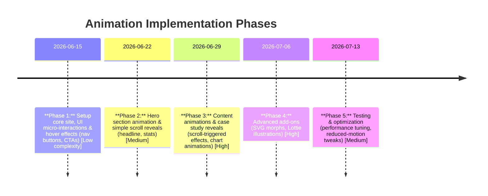

# Modern JavaScript Animations for PREPOC Website

**Executive Summary:** To create a premium agency site with engaging, lead-generating animations, we recommend a mix of micro-interactions, hero animations, scroll-triggered effects, and subtle SVG/Lottie motion. We start by studying top examples (from Anime.js, GSAP, Framer Motion, Awwwards, Codrops, etc.) to identify 12–15 inspiring patterns. Each reference is analysed for interaction pattern, animation type, accessibility/performance considerations, and suitable library (anime.js, GSAP, Framer Motion, Three.js, Lottie, or vanilla Web Animations API). Key implementation notes (with code/pseudocode) cover React+Vite integration, Tailwind styling, and Django-based asset delivery. A detailed roadmap table then maps each animation to complexity, dev time, performance risk, and priority (lead-generation impact). We also list recommended asset formats (SVGs, Lottie files, optimized images) and optimisation tips (compression, lazy-loading). Finally, we summarise UX motion guidelines (recommended durations, easing, and reduced-motion support) to ensure animations delight without distracting or hurting accessibility. 

## 1. Top Animation Design References

We gathered a shortlist of ~12–15 outstanding web animation examples. For each we give the **Title (link)**, a screenshot/hero image URL (where available), a brief effect description, and relevance to PREPOC.

- **Pop-up Particle Button (CodePen, anime.js)** – A button that explodes into particles on click (microinteraction). Particles radiate outward, fade out, then reposition. *Interaction:* Button click microinteraction. *Motion:* Particle burst + fade. *Library:* Anime.js (ideal for coordinated keyframe sequences). *Accessibility:* Non-essential motion (instant effect, easily fast). Check reduced-motion and ensure focus state. *Performance:* CSS transforms/opacity on many elements – moderate cost. *Relevant:* Eye-catching CTA effect that draws attention to “Start Free Consultation” buttons.  

- **Text Scramble (CodePen, GSAP)** – Text that scrambles/glitches into a new headline on page load. Random letters shuffle into place. *Interaction:* Page-load hero text effect. *Motion:* Character-by-character scramble (micro keyframe). *Library:* GSAP (TweenMax or SplitText for per-character). *Accessibility:* Provide readable fallback (avoid flashing letters too fast). Honor reduced-motion (skip scrambling, show final text). *Performance:* Single text element; uses JS per-frame updates – low impact. *Relevant:* Adds “wow” to headlines (eg “Scale Your Business…”), reinforcing brand dynamism.  

- **Scrolling Timeline Animation (Codrops Playground)** – A multi-section scroll page where SVG shapes morph and content fades in as user scrolls. *Interaction:* Scroll-triggered reveal + SVG morph. *Motion:* Scroll-driven timeline, with elements sliding/morphing into view. *Library:* GSAP ScrollTrigger (pinning, scrub). *Accessibility:* Ensure linear reading order for keyboard; skip animations on reduced-motion. *Performance:* Continuous scroll handlers – use IntersectionObserver or ScrollTrigger’s optimized listeners. *Relevant:* Ideal for PREPOC’s “Process” or “Why Choose Us” sections, guiding visitors through steps.  

- **SVG Logo Morph (Dribbble/CodePen)** – Logo or shape that smoothly morphs between icons (e.g. abstract shapes to company logo). *Interaction:* Hero or hover effect (logo animation on load or hover). *Motion:* SVG path morphing. *Library:* Anime.js or GSAP with MorphSVG plugin (anime.js also handles SVG paths well). *Accessibility:* Provide static logo if no JS; avoid too much motion. *Performance:* SVG path anim (light). *Relevant:* Reinforces branding with a sophisticated flair.  

- **Interactive Lottie Illustration (LottieFiles example)** – A small vector animation (e.g. a robot, chart, or character) that plays when the user scrolls or clicks. *Interaction:* Scroll or button-triggered vector animation. *Motion:* Pre-made JSON animation (complex motion design). *Library:* Lottie (renders After Effects animations with bodymovin). *Accessibility:* Autoplay off; activate only on user action or in-view. Provide PNG fallback if unsupported. *Performance:* Lottie can be heavy (multiple vectors). Lazy-load JSON when needed. *Relevant:* Showcases AI/automation features in “AI & Automation” section with eye-catching illustrations.  

- **3D WebGL Scene (Three.js or Spline)** – A subtle 3D background (e.g. rotating 3D model or particles) in the hero section. *Interaction:* Ambient/looping or on-scroll 3D. *Motion:* Continuous 3D rotation or parallax. *Library:* Three.js or Spline (3D web engine). *Accessibility:* Mark as decorative (aria-hidden); disable if low performance. *Performance:* High risk (GPU-intensive). Fallback to static image for mobile/old devices. *Relevant:* Conveys “cutting-edge” tech; use sparingly due to performance.  

- **Cursor-Interactive Effect (CodePen Demo)** – Custom cursor or hover effect (e.g. trailing glow circle that follows mouse, or image zoom on hover). *Interaction:* Mouse-hover effect on links/buttons. *Motion:* Transform/scale on hover; particle trail or cursors. *Library:* Vanilla JS or small library (anime.js for trail tween, CSS for simple effects). *Accessibility:* Custom cursors can break defaults; provide standard cursor fallback. *Performance:* Low (CSS) to moderate (canvas trails). *Relevant:* Increases delight on clickable elements (like CTA buttons) but ensure touch fallback.  

- **Section Pinning & Reveal (Smashing Magazine example)** – A full-viewport section that pins (stays fixed) while sub-elements animate in/out as user scrolls. *Interaction:* Scroll-driven full-page sections. *Motion:* Pin/scroll scrubbing content (fade/slide). *Library:* GSAP ScrollTrigger with `pin:true`. *Accessibility:* Fixed sections can hinder scroll; ensure focus. Consider skip-links. Reduced-motion: skip pin, allow normal scroll. *Performance:* Moderate (one big container; mostly CSS transforms). *Relevant:* Good for “Case Studies” presentation (each case in its own scroll-pinned panel).  

- **Button Morph/Highlight (Awwwards example)** – Buttons or cards with liquid-hover or bounce effect on hover (e.g. expanding highlight). *Interaction:* Hover microinteraction. *Motion:* Scale-up, color fill, or slight bounce. *Library:* Framer Motion (React, for simple spring animations) or anime.js. *Accessibility:* Ensure focus styles (use same motion or immediate style change). Quick effects (<200ms) to not delay click. *Performance:* Very low (CSS transform/scale). *Relevant:* Modernises UI elements (e.g. “Read More” cards) with subtle feedback.  

- **Animated Statistical Charts (CodePen/Behance)** – Bar or line charts that animate values counting up when scrolled into view. *Interaction:* Scroll-triggered chart reveal. *Motion:* Bars grow or numbers count up. *Library:* Anime.js for number tween or GSAP for timelines. *Accessibility:* Provide real numbers to screen readers (ARIA-live or non-animated fallback). *Performance:* Low (canvas or div heights). *Relevant:* Showcase ROI data or portfolio success stats with dynamic flair.  

- **Hero Background Parallax (Webflow/Inspiration)** – A layered parallax effect on the landing hero (background moves slower than foreground). *Interaction:* Scroll or mouse-move parallax. *Motion:* Smooth parallax offset. *Library:* Vanilla JS (mousemove listener) or GSAP (quickSetter for performant y translate). *Accessibility:* Subtle movement only; disable for reduced-motion. *Performance:* Use `transform: translateZ(0)` on layers; throttle mouse events. *Relevant:* Adds depth to homepage visuals (ensure hero still loads without JS).  

- **Team Carousel with Animation (CSS-Tricks/Gsap)** – A slider of team photos/quotes with animated transitions (fade/sliding). *Interaction:* Auto or user-controlled slideshow. *Motion:* Slide-in/out or crossfade. *Library:* Swiper.js or GSAP timeline. *Accessibility:* Provide pause button; ensure screen readers can skip/stop auto-rotation. *Performance:* Moderate (image loading); use CSS transitions if simple. *Relevant:* Presents “Team” or “Clients” elegantly, boosting credibility.  

- **Micro Page-Load Animations (Behance)** – Subtle fade-ins or glide animations on page sections when first loaded. *Interaction:* Page load animation. *Motion:* Container or elements fade/translate in. *Library:* Framer Motion or plain CSS `@keyframes`. *Accessibility:* Use prefers-reduced-motion to disable. *Performance:* Very low (one-time). *Relevant:* Immediately engages visitors (above-the-fold) and establishes polish.  

Each example above illustrates a pattern relevant to a growth-agency site: from hero animations and scroll reveals to button hovers and icon animations. We highlight the **motion type** (microinteraction, scroll-trigger, transition, etc.), accessibility concerns (especially `prefers-reduced-motion`), performance impact, and suggest a suitable library:

- **Recommended Libraries:** 
  - *anime.js* – great for finely-timed sequences, SVG morphs, staggered letter/shape effects. 
  - *GSAP* – powerful timelines and plugins (ScrollTrigger, MorphSVG) for complex scroll and SVG animations. 
  - *Framer Motion* – React-focused, ideal for component/transition animations and simple physics curves. 
  - *Lottie* – for pre-made vector animations (exported from After Effects). 
  - *Three.js/WebGL* – only for ambitious 3D scenes (use sparingly with fallback). 
  - *Web Animations API* – for lightweight JS-driven animations if no external lib needed (but less intuitive API).

## 2. Implementation Notes

Below are key implementation patterns and code snippets in JS/React for these animations. (In all cases use progressive enhancement: detect `prefers-reduced-motion` and disable non-essential animations if set.)

- **Button/Particle Burst (anime.js):**  
  ```js
  import anime from 'animejs/lib/anime.es.js';
  function handleClick() {
    anime.timeline()
      .add({
        targets: '.burst-particle',
        translateX: () => anime.random(-50,50),
        translateY: () => anime.random(-50,50),
        opacity: [1, 0],
        scale: [0.5, 2],
        duration: 600,
        easing: 'easeOutCubic',
        complete: () => anime.set('.burst-particle', {opacity: 0})
      });
  }
  // In React: attach handleClick to button onClick, generate particles as needed
  ```
  Use Tailwind to position particles absolutely, and reset animation on end. For React+Vite, import anime in a `useEffect` or event handler. Ensure to check `if (prefersReduced) return;` before animating.

- **Headline Text Scramble (GSAP + SplitText):**  
  ```js
  import { gsap } from 'gsap';
  import { SplitText } from 'gsap/SplitText';
  gsap.registerPlugin(SplitText);
  useEffect(() => {
    if (window.matchMedia('(prefers-reduced-motion: reduce)').matches) return;
    const split = new SplitText(".headline", { type: "chars" });
    gsap.from(split.chars, { 
      opacity: 0, y: 20, 
      stagger: 0.05, duration: 0.6, ease: "back.out(1.7)" 
    });
    return () => split.revert();
  }, []);
  ```
  This reveals each character. For a real scramble, swap chars in between. Ensure `.headline` is semantically <h1>.

- **ScrollReveal (IntersectionObserver):**  
  ```js
  // Vanilla scroll trigger
  const elements = document.querySelectorAll('.reveal-on-scroll');
  const observer = new IntersectionObserver((entries) => {
    entries.forEach(entry => {
      if (entry.isIntersecting) {
        entry.target.classList.add('animate-fade-in');
        observer.unobserve(entry.target);
      }
    });
  }, { threshold: 0.1 });
  elements.forEach(el => observer.observe(el));
  ```
  In React, use `useEffect` to select and observe refs. The CSS class `.animate-fade-in` (with Tailwind classes or @keyframes) handles the fade/slide. This is performant and works without heavy libraries. Alternatively, use GSAP ScrollTrigger for complex timelines.

- **SVG Morph (anime.js):**  
  ```js
  anime({
    targets: '.logo path',
    d: [
      { value: 'M0,0 L ... '}, // original path
      { value: 'M10,10 L ... '}  // morph target
    ],
    duration: 1000,
    easing: 'easeInOutQuad'
  });
  ```
  The `d` attribute tween smoothly morphs shapes. Use React refs to target SVG elements. If targeting complex shapes, GSAP MorphSVG plugin can be easier (but needs a license).

- **Lottie Animation (React):**  
  ```jsx
  import Lottie from 'react-lottie-player';
  import animationData from './illustration.json';
  function RobotAnimation() {
    return (
      <div className="w-64 h-64">
        <Lottie
          loop
          animationData={animationData}
          play
          style={{ width: 256, height: 256 }}
        />
      </div>
    );
  }
  ```
  Use [react-lottie-player](https://github.com/mifi/lottie-react) or [lottie-web](https://github.com/airbnb/lottie-web) directly. Load JSON from LottieFiles (minify if large). Autoplay only when in viewport (IntersectionObserver to set `play` prop). Provide `aria-hidden="true"` if purely decorative.

- **Page Transitions (Framer Motion):**  
  ```jsx
  import { motion, AnimatePresence } from 'framer-motion';
  function Page({ children }) {
    return (
      <AnimatePresence exitBeforeEnter>
        <motion.div
          key={pathname}
          initial={{ opacity: 0, y: 10 }}
          animate={{ opacity: 1, y: 0 }}
          exit={{ opacity: 0, y: -10 }}
          transition={{ duration: 0.5 }}
        >
          {children}
        </motion.div>
      </AnimatePresence>
    );
  }
  ```
  Wrap pages so navigation triggers fade/slide. Tailwind classes can be applied normally; motion handles only transform/opacity.

- **Cursor Trail (JavaScript):**  
  ```js
  // Simple dot follows cursor
  const dot = document.createElement('div');
  dot.className = 'cursor-dot fixed w-3 h-3 bg-accent rounded-full pointer-events-none';
  document.body.appendChild(dot);
  document.addEventListener('mousemove', e => {
    dot.style.transform = `translate(${e.clientX}px, ${e.clientY}px)`;
  });
  ```
  This creates a small dot that follows the pointer. Tailwind classes ensure it's on top. For React, insert this in a top-level component effect. For more complex trails (particles), use canvas or requestAnimationFrame loops with GSAP.

- **Performance & Enhancement Tips:**
  - Always wrap animations in a `prefers-reduced-motion` check (JS or CSS) to disable or simplify for users who prefer minimal motion. E.g.:  
    ```css
    @media (prefers-reduced-motion: reduce) {
      .animated { animation: none !important; transition: none !important; }
    }
    ```
  - For scroll-triggered effects, use **`IntersectionObserver`** (pure JS) or **GSAP ScrollTrigger** for smooth pin/scrub. These avoid heavy scroll event loops.
  - **Lazy-load** heavy assets: defer Lottie JSON, 3D models, or large images until needed. In React, use dynamic `import()` or `<Suspense>`.
  - Use **will-change** CSS sparingly (e.g. on elements that will animate) to hint GPU. Remove it after the animation to avoid performance hits.
  - If using Tailwind, add utility classes for `transform-gpu` or `will-change` as needed, and tune with `transition-[prop]`, `duration-300` etc.

- **React+Vite+Tailwind+Django Integration:**
  - Build the React front-end (Vite) as a standalone SPA or integrated via Django templates. Ensure static files (JS bundles, CSS) are served via Django’s static file pipeline or a CDN.
  - For assets (SVGs, Lottie JSON), place them in `public/` or import them in JS. Django can also serve SVG/JSON via static routes if needed.
  - Use environment variables in Vite for any API endpoints (if animations fetch data). 
  - Manage stateful animations using React hooks (`useRef` for elements, `useEffect` for startup animations).
  - Tailwind can handle responsive breakpoints: e.g. disable certain animations on small screens (`sm:animate-none`) for performance on mobile.
  - Progressive enhancement: detect if JS fails or is disabled, ensure all vital content (text, CTAs) is visible without animations.



## 3. Animation Roadmap (Prioritised)

| Animation                                | Complexity | Est. Dev Time | Perf. Risk | Lead-Gen Priority | Notes                                                          |
|------------------------------------------|:----------:|:-------------:|:----------:|:-----------------:|---------------------------------------------------------------|
| Hero Background Animation (parallax/3D)  | High       | 1.5 weeks     | High       | High              | High visual impact; fallback as static image for mobiles.     |
| Headline Text Reveal (scramble)          | Medium     | 1 day         | Low        | High              | Above-the-fold; skip if reduced-motion.                       |
| Call-to-Action Button Burst (particles)  | Medium     | 2 days        | Medium     | High              | Encourages clicks; simple DOM particles or canvas.            |
| Scroll-triggered Section Reveals        | Medium     | 3 days        | Low        | High              | Keeps user engaged while reading; GSAP/IO implementation.     |
| SVG Logo/Shape Morphing                 | Medium     | 2 days        | Low        | Medium            | Brand effect; ensure compatible fallback (static SVG).        |
| Animated Charts/Stats (count-up)        | Low        | 1 day         | Low        | Medium            | Builds credibility; numbers animate on scroll.                |
| Micro Hover Effects (buttons, icons)    | Low        | 1 day         | Low        | Medium            | Improves UI feel; use CSS transitions or Framer Motion.       |
| Lottie Illustration (scroll or click)   | High       | 1 week        | Medium     | Medium            | Visual storytelling; load when needed.                        |
| Cursor/Trail Effects                   | Medium     | 2 days        | Medium     | Low               | Delight factor; must not hinder usability (disable on mobile).|
| Page Transitions (SPA)                 | Medium     | 3 days        | Low        | Low               | Smooth flow; use AnimatePresence in React.                    |
| Testimonials/Team Carousel              | Medium     | 2 days        | Low        | Low               | Supports trust; slider plugin or CSS.                         |
| Subtle Ambient Animations (particles)   | High       | 1 week        | High       | Low               | Atmosphere (e.g. tiny moving dots); purely decorative.        |
| SVG Icon Micro-animations (on load)     | Low        | 1 day         | Low        | Low               | e.g. checkmark draw, small touches.                           |

*Estimates assume a developer familiar with the chosen tools. “Perf. Risk” flags heavy animations (3D, long particle loops) to optimise or provide static alternatives. “Priority” focuses high on hero, CTAs, scroll engagement (directly aiding conversions).*

## 4. Assets & Optimisation Tips

- **SVGs:** Use SVG for icons/logos/micro-illustrations. Compress SVG code (e.g. [SVGOMG](https://jakearchibald.github.io/svgomg/)). For complex animated SVG (e.g. path morph), pre-calculate key shapes. Inline critical SVGs in HTML/JS for faster load.
- **Lottie (JSON) Files:** Limit number of layers and image textures in the source After Effects. Use [lottie-web](https://github.com/airbnb/lottie-web) to minify JSON. Lazy-load Lottie JSON via dynamic import or intersection observer.
- **Images:** Serve hero and background images in modern formats (WebP/AVIF) at appropriate resolutions (e.g. 1920px wide for full-screen, 2x for retina). Use `srcset` and Tailwind’s responsive utilities to load smaller images on mobile. Preload key hero image for LCP.
- **3D Models:** If using Three.js, simplify geometry and textures. Consider using [GLTF compressed with Draco](https://github.com/google/draco) and async load. Otherwise, skip 3D on older devices.
- **Sprites/Icons:** For repeated small animations (e.g. shimmering loader), use CSS sprite sheets or icon fonts where feasible to reduce DOM.
- **General:** Minify and bundle JS (Vite does this). Use code-splitting: put animation libraries in a separate chunk loaded only on pages that use them. Remove unused code (Tree-shaking).
- **Caching:** Version your static assets (hash filenames) so returning users get updated animations only when changed.

## 5. UX Guidelines for Motion

- **Duration & Timing:** Follow standard UX timing:
  - Micro-interactions ~150–300ms (instant feedback on hover/click).
  - Content transitions ~300–600ms (e.g. section slide-in).
  - Hero and storytelling animations ~800ms–1500ms (longer, but avoid >2s for critical info).
- **Easing:** Use gentle, natural easings:
  - “Ease-out” (cubic-bezier(0.25,0.46,0.45,0.94)) for entering elements (gives deceleration).
  - “Ease-in” for exiting. 
  - Material Design’s [standard curves](https://material.io/design/motion/speed.html) or CSS `ease-in-out` are good defaults.
- **Stagger:** When animating lists or groups, stagger children by ~50–100ms to create a flow.
- **Reduced Motion:** Honor user preferences via CSS or JS:
  ```css
  @media (prefers-reduced-motion: reduce) {
    *, :before, :after {
      animation-duration: 0.001ms !important;
      animation-iteration-count: 1 !important;
      transition-duration: 0.001ms !important;
    }
  }
  ```
  Or in JS: 
  ```js
  const prefersReduced = window.matchMedia('(prefers-reduced-motion: reduce)').matches;
  if (prefersReduced) { 
    // Skip or simplify animations 
  }
  ```
- **Accessibility:**  
  - Do not remove critical content: animations should enhance, not replace.
  - For dynamic content (e.g. count-up stats), use ARIA labels or live regions if values update after load.
  - Ensure text remains legible (no low-contrast flicker). Avoid flashing or strobing effects entirely.
  - Keyboard focus should pause or reduce motion if on animated element.
- **User Control:** For any auto-scrolling or carousels, provide controls (pause, next/prev). Always allow the user to scroll without interference.

Following these principles ensures animations **delight** users and reinforce PREPOC’s brand (innovative, data-driven) without harming usability or performance.

## Sources

- **Anime.js Documentation** – JavaScript animation engine (project site, examples)  
- **GSAP (GreenSock) Documentation** – Advanced JS animation (ScrollTrigger, timeline, SVG)  
- **Framer Motion Docs** – React animation library (components, gestures)  
- **LottieFiles Documentation** – Animated SVG/JSON from After Effects (usage guide)  
- **Three.js Documentation** – 3D on the web (when needed)  
- **MDN Web Docs – Web Animations API & CSS Media Queries** (animation techniques, `prefers-reduced-motion`)  
- **Web.dev – Animation and Performance** (guides on performance, accessibility)  
- **Smashing Magazine – Designing with Motion** (best practices, user preference)  
- **Awwwards – CSS & JS Animation Collection** (inspiration gallery of award-winning sites)  
- **Codrops Playground** – Creative animation demos (scroll, SVG, canvas)  
- **CSS-Tricks – GSAP & Animation Articles** (practical tutorials, hack tips)  

*Sources include official docs and expert articles on modern web animation techniques, ensuring up-to-date best practices.*